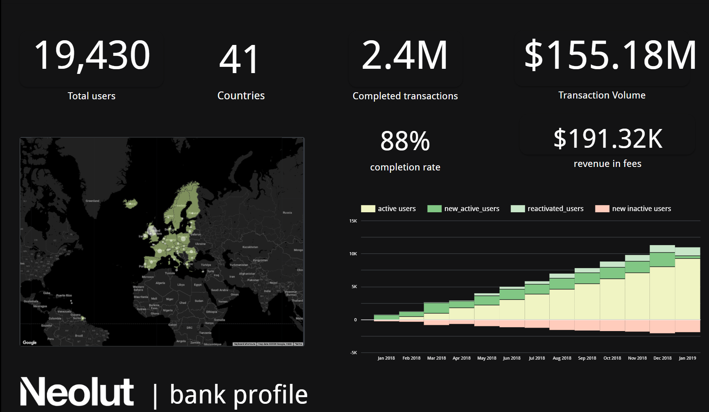
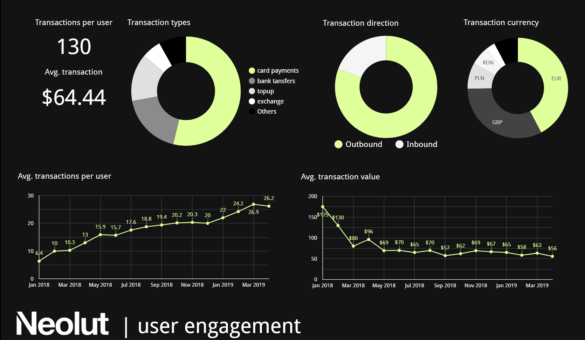
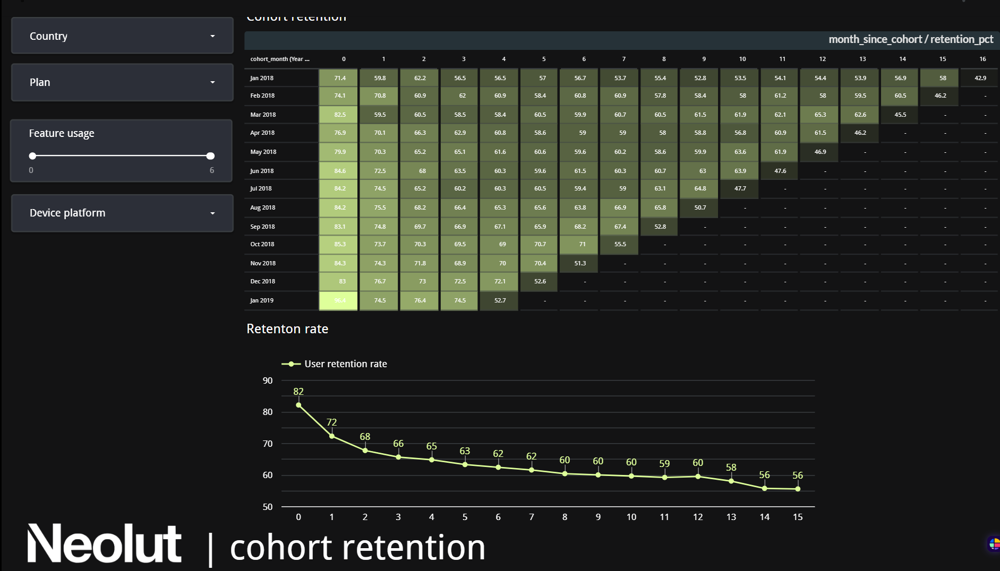
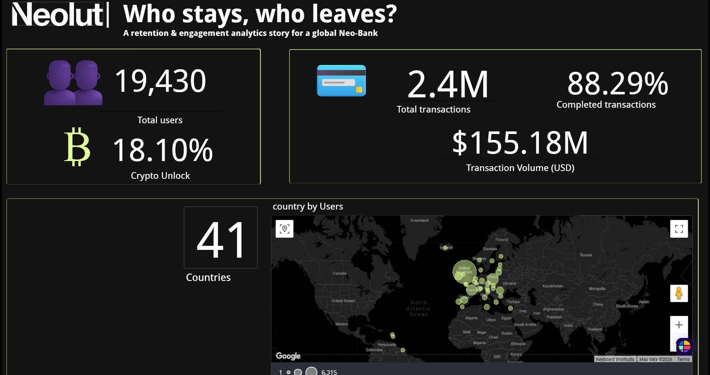

# Retention & Engagement Analytics for a Global Neo-Bank

## Project Overview

This project explores customer retention, engagement, and churn risk within a global Neo-Bank environment.

The objective was to understand user behaviour, identify key drivers of retention and churn, and provide actionable business recommendations to improve long-term customer engagement.

This project was developed as part of a team-based Data Analytics Bootcamp final project.

---

## Business Problem

The Neo-Bank aims to better understand:

- How users engage with the platform
- When users are most likely to churn
- Which customer behaviours are associated with higher retention
- Opportunities to improve user engagement and reduce churn

---
## Project Presentation

The final project presentation is available here:

[📄 Final Presentation](presentation/Neo_Bank_Presentation.pdf)

## Team Project

The screenshots below showcase selected pages from the final team dashboard, while my individual contribution is detailed in a dedicated section.

## Dashboard Preview
The following screenshots showcase selected pages from the final team dashboard.

### Bank Profile



### User Engagement



### Cohort Retention



## My Contribution

I was responsible for developing the Executive Overview dashboard, providing stakeholders with a high-level view of customer activity, transaction performance, geographic reach, and key business KPIs.

My contributions included:

- Defining and designing key business KPIs
- Exploring, cleaning, and validating transaction data
- Building an MCC reference table and enriching transaction data to enable merchant category analysis
- Developing geographic distribution insights across the customer base
- Contributing to business storytelling and stakeholder communication
- Supporting the development and delivery of the final project presentation
- Communicating findings to both technical and non-technical audiences

### Executive Overview Dashboard



This dashboard page was designed and developed as my primary contribution to the project.
---
## Key Findings

- Retention drops most sharply during the first two months after signup.
- Customers using 5–6 key features show the lowest churn risk.
- Standard plan users are more likely to become at risk than Premium or Metal customers.
- Risk increases with age, particularly among users aged 45+.
- Transaction patterns suggest the platform is increasingly used for daily banking activities.
- The United Kingdom represented the largest user base in the dataset.

---
## Business Recommendations

### Activation
- Focus onboarding and activation efforts during the first two months.
- Define clear activation milestones and success metrics.

### Diversification
- Encourage customers to adopt additional key features.
- Use onboarding flows and gamification to increase feature usage.

### Upgrade
- Promote Premium and Metal plans through targeted campaigns.
- Offer trial periods to encourage plan upgrades.

---

## Tools Used

- SQL (BigQuery)
- Looker Studio
- Google Sheets
- Power BI (exploratory analysis)
- Google Slides

---

## Repository Structure

```text
images/        Dashboard screenshots
presentation/  Final presentation
SQL/           SQL analysis and KPI development
README.md      Project documentation
```

---
## SQL Analysis

Selected SQL queries used during the project are available in the [SQL](SQL/) folder.

These include:

- Data quality assessment
- Executive KPI development
- Merchant Category Code (MCC) exploration
